# WEEK TWO

## Data Collection as Art

Links of interest in connection with data collection:

<https://quickdraw.withgoogle.com/data>  
<https://theconversation.com/drawing-data-i-make-art-from-the-bodily-experience-of-long-distance-running-182762>  
<https://towardsdatascience.com/generating-data-by-drawing-c169fe10632>

## It's Only a Fleshwound  

Is an apology just another platitude?  

### Video Animation  

### Flesh Wound  

I took your advice and channeled all my rage and sadness from what happened into a piece of art.  

YOUTUBE LINK GOES HERE  

I have taken a large bag of band aids collected from at home medical injection kits (they always sent a ridiculous amount) and have stamped them with the words IM SORRY. Josh and I will be setting up a camera on a tripod and put me in front of it. Meanwhile Josh slowly covers my face in band-aid apologies, until I can't see or speak, and finally until you can't see me anymore.

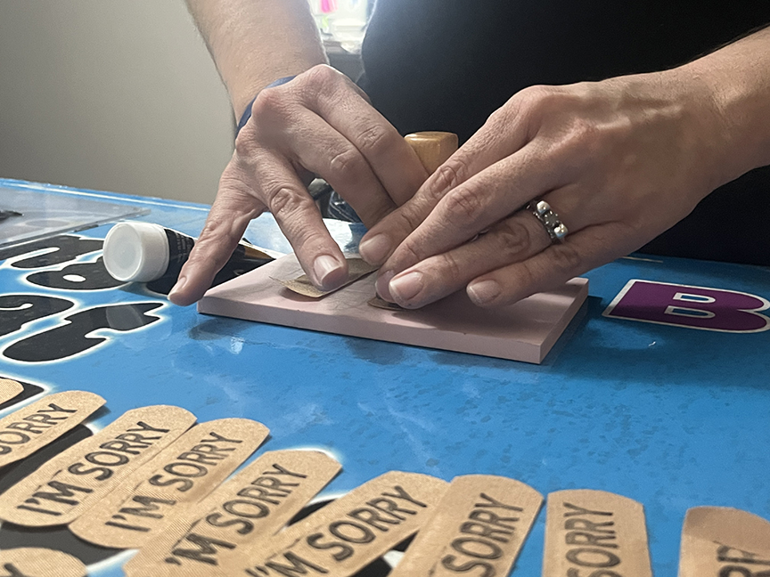  
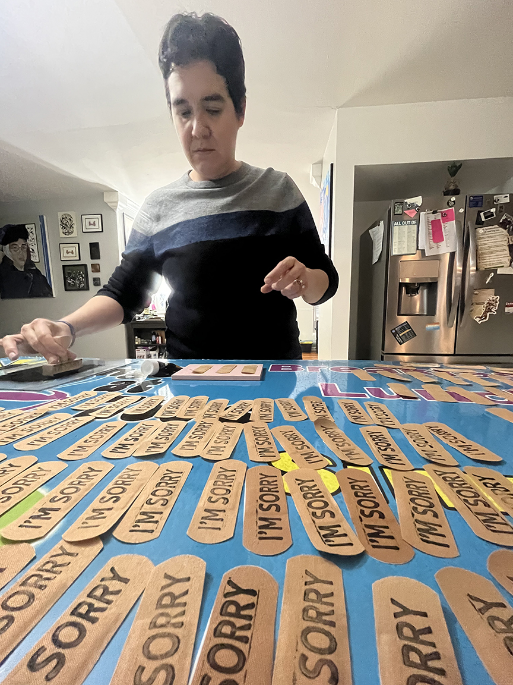  
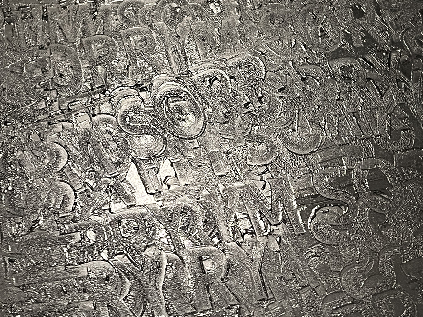  
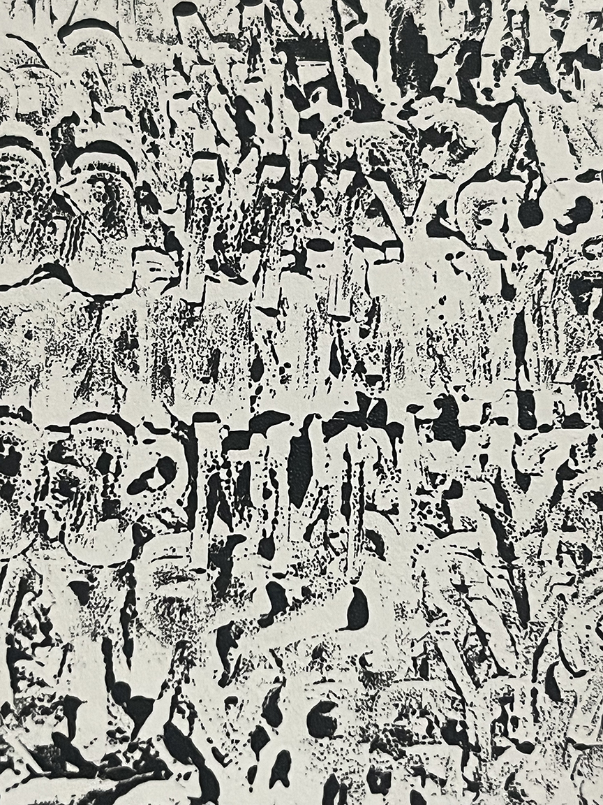  

## Accupuncture  

As a first step away from conventional care and towards whatever the hell works and doesn't drain my bank account, I have started doing accupuncture treatments again. I had some success with it in my early 20s, but needed more aggressive treatment for cancer and didn't have the budget to do both. Much to my surprise, it is covered by my insurance and I am only paying $30 a session. They have recommended 8-12 and I will be "sketching" with my body at every session.  

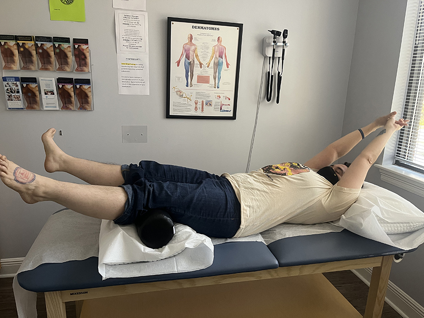  
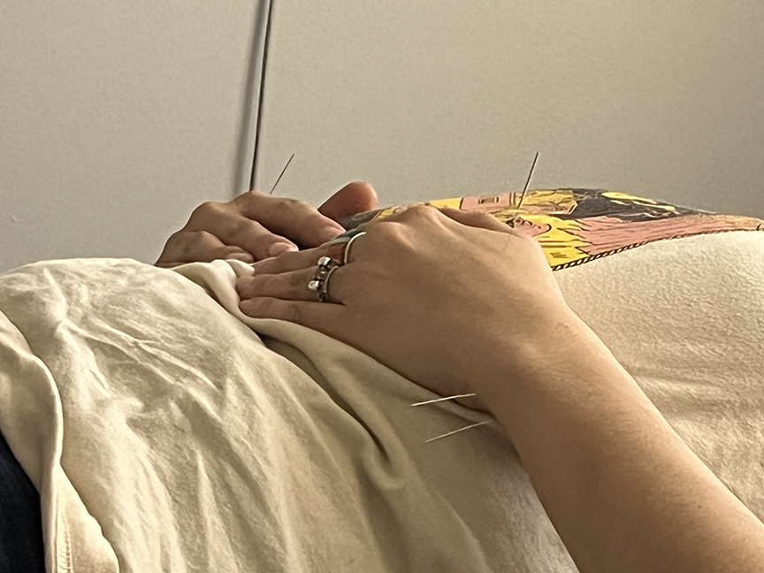  
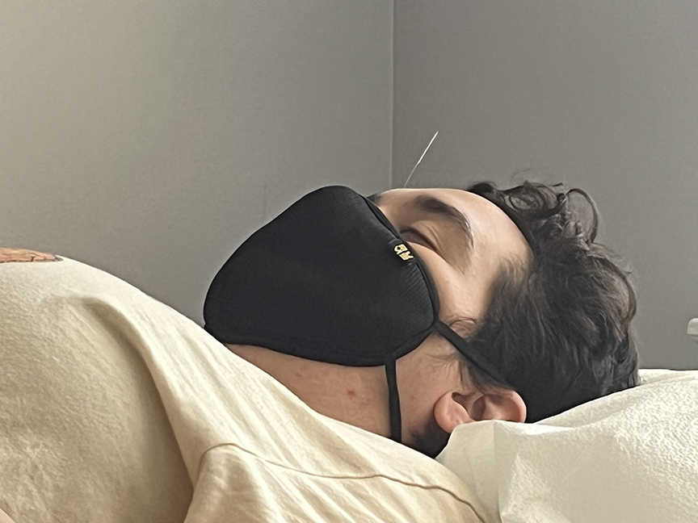  
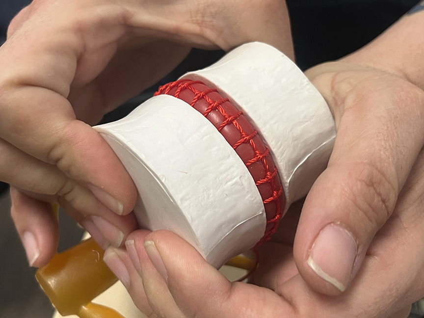  
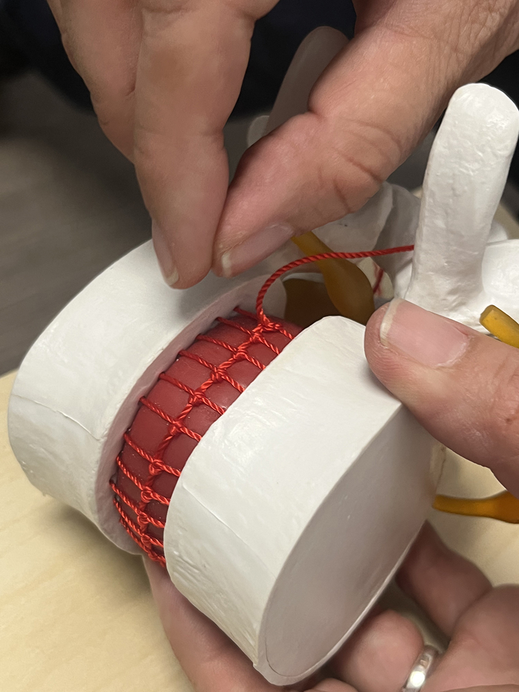  

There were two videos I wanted to include, but after digging through some online forums found out that will involved either setting up an external storage area like youtube or vimeo to embed links to. I'll work on getting that up and running after I finish editing the last podcast episode.  

## Indra's Net  

I approached my installation in WMC as an opportunity to sketch for my potential upcoming solo show. I'm leaning into trusting myself and my instincts more and not being neurotically attached to a plan. They usually don't work out anyway, so why make them? I can start with ideas, and those are much more flexible than plans.  

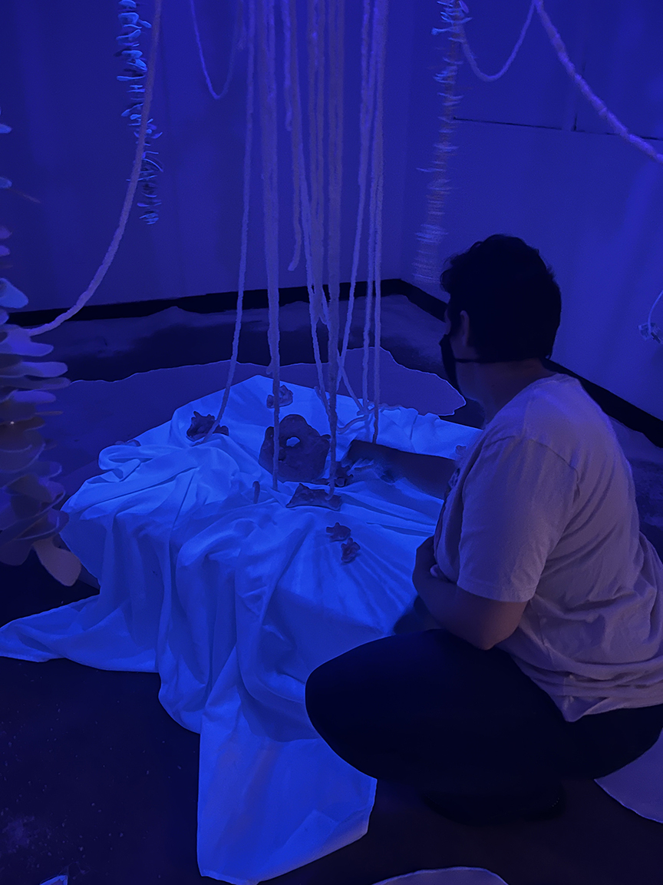  
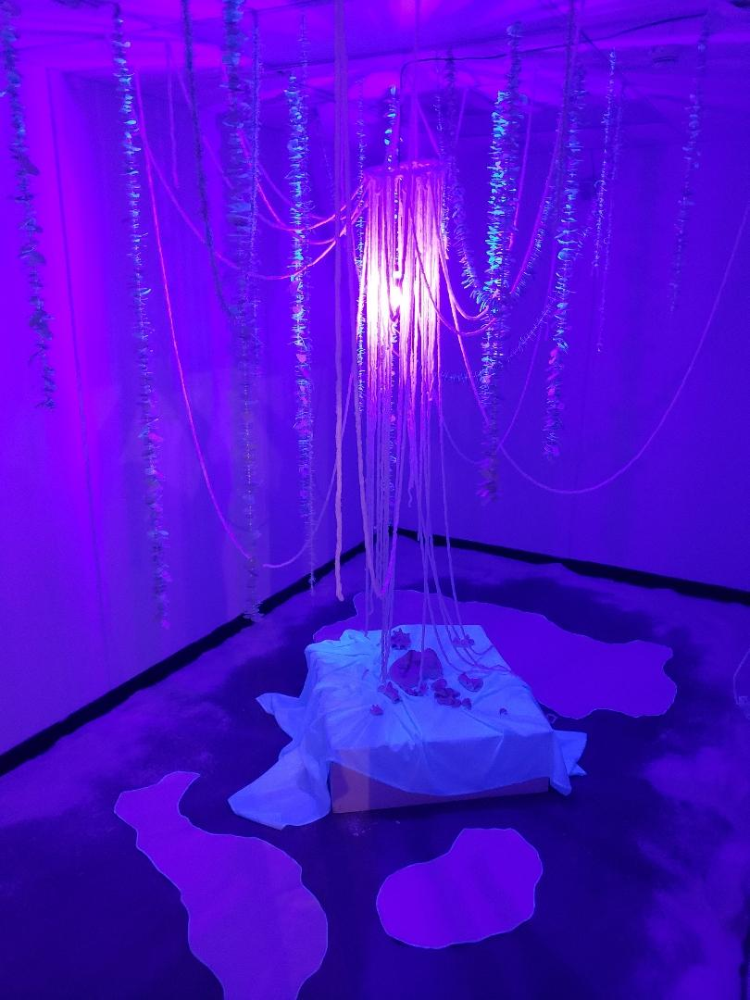  
