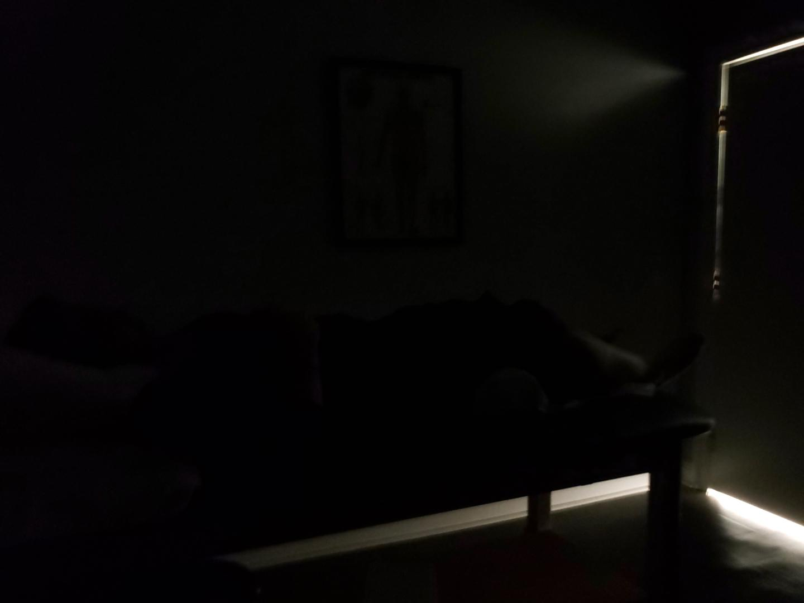
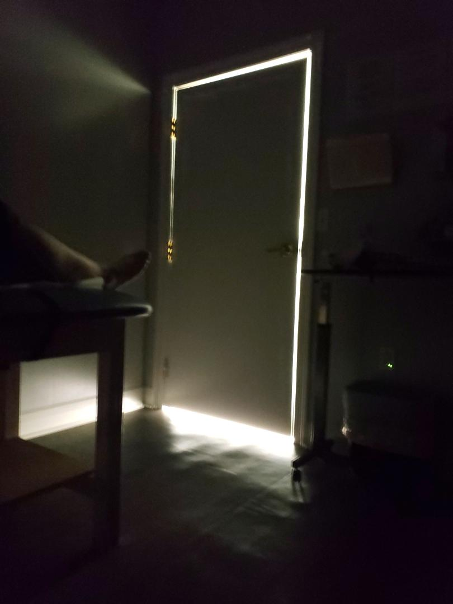
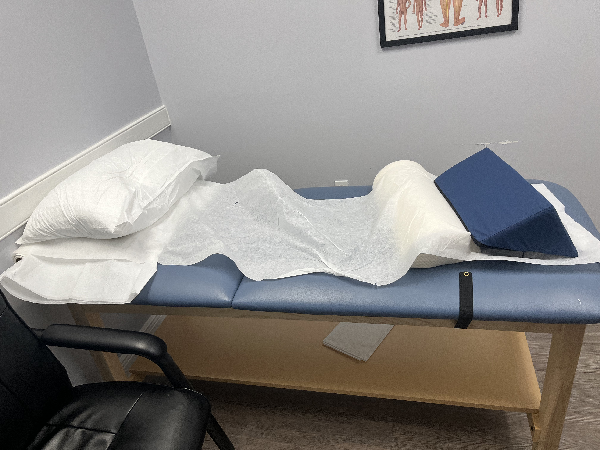
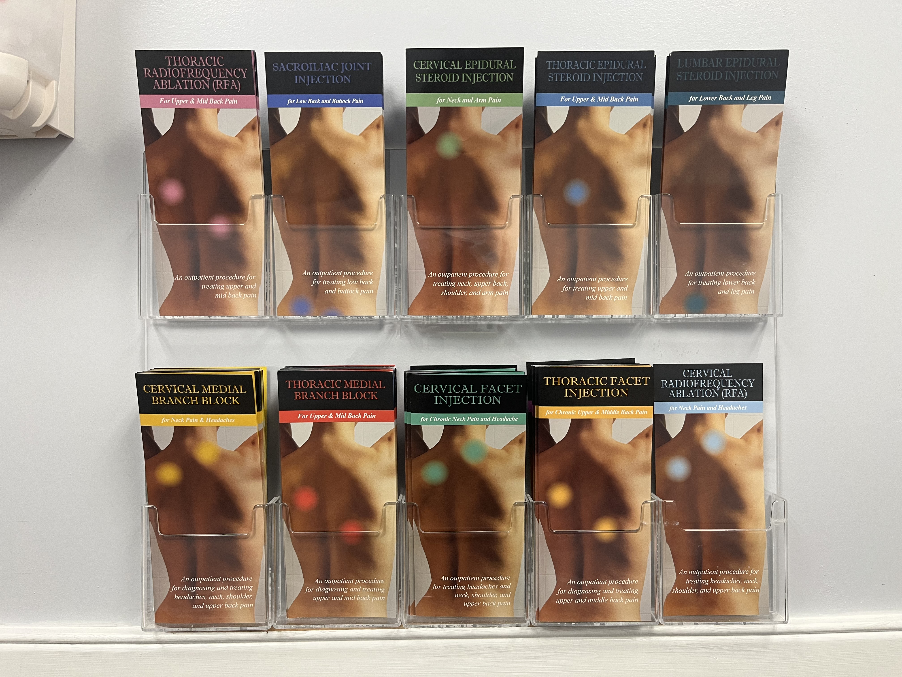
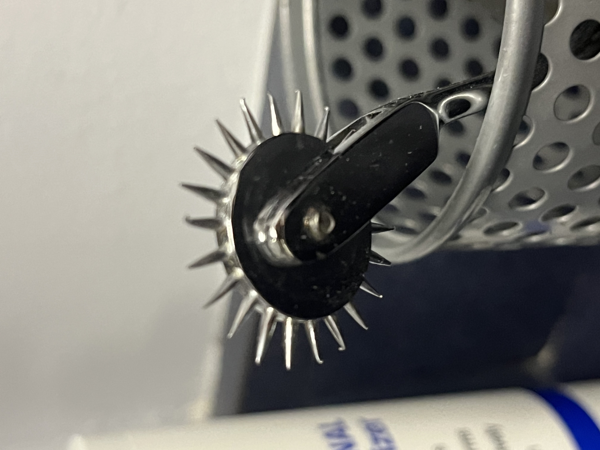
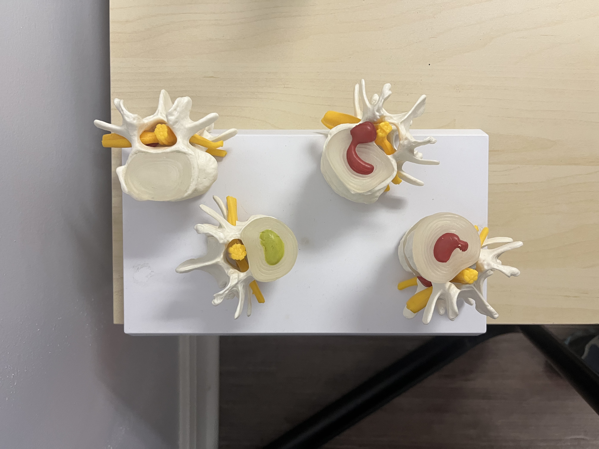
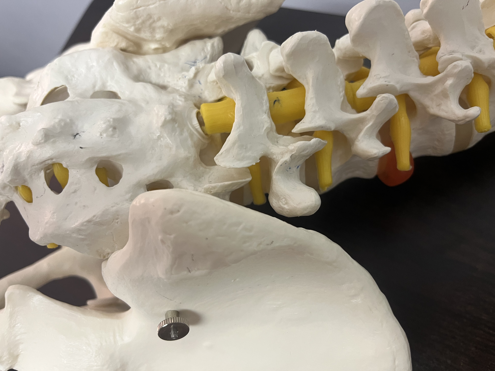
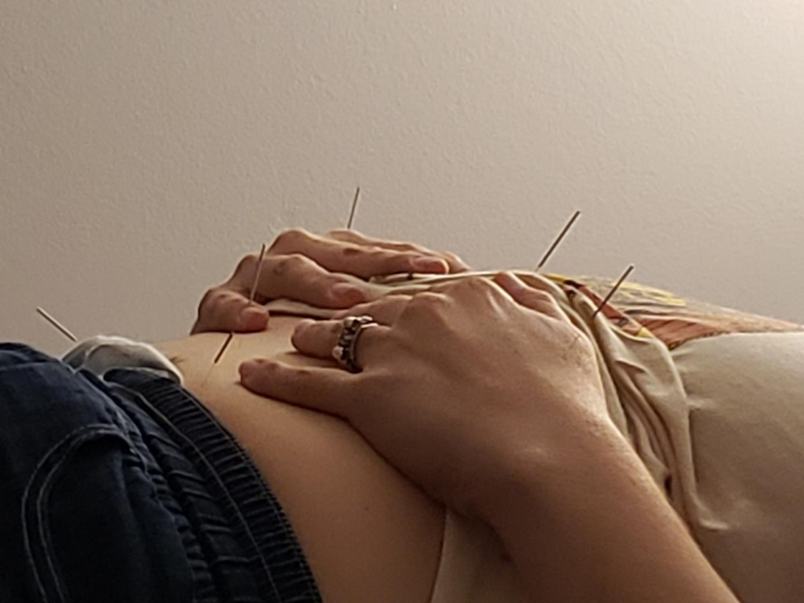

# WEEK FOUR  

I've been thinking more about words, about the writing I'm doing, and the idea of access. I'm doing some drawing experiments with alt text - using the words and sentences themselves to shape the form of something I am looking at. I went back to re-read some of the e.e. cummings poetry I have - looking at the words, spacing, and punctuation as elements that can be maniuplated.  

## Accupuncture  

This was the second session:  

  
  
  
  

This was my third session. I am in a different room each time and there are different objects and lights in each room. I see the room and its contents as potential for more play and conceptual exploration.  

  
  
  
  
  
