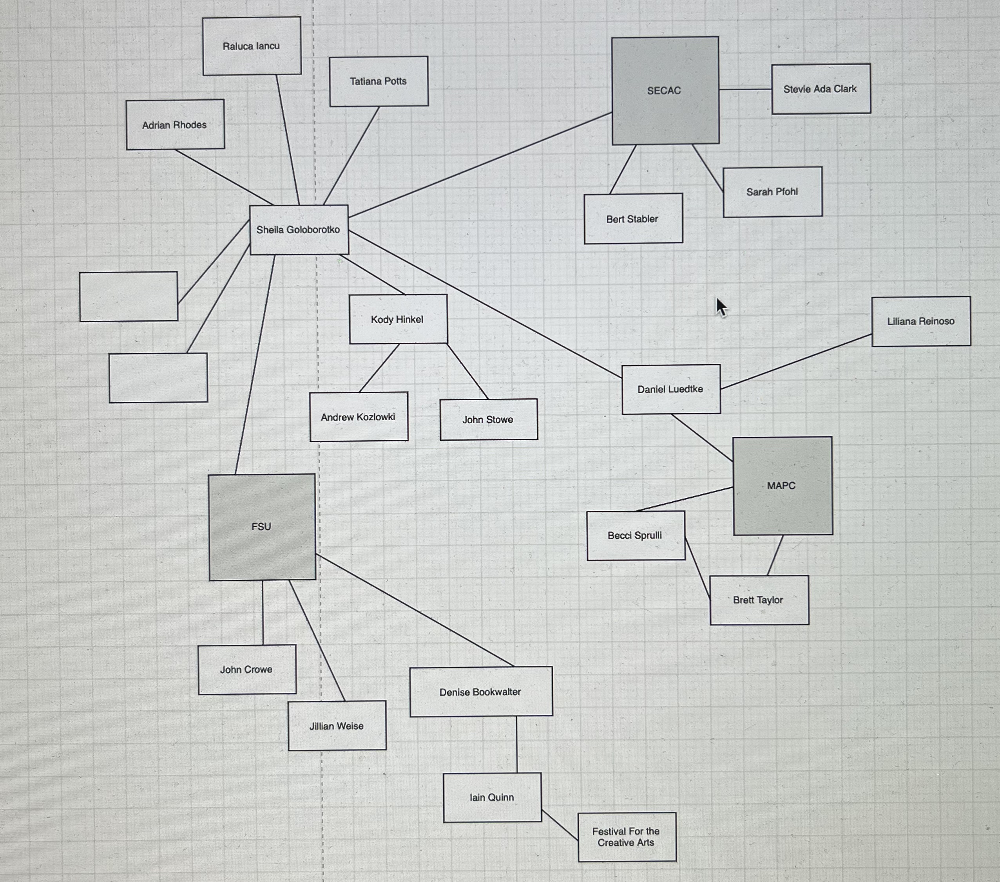
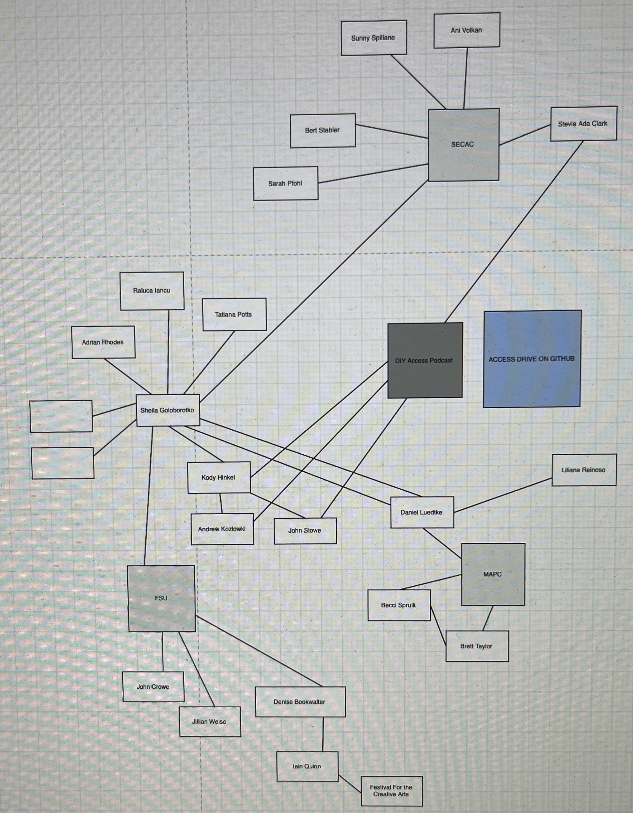
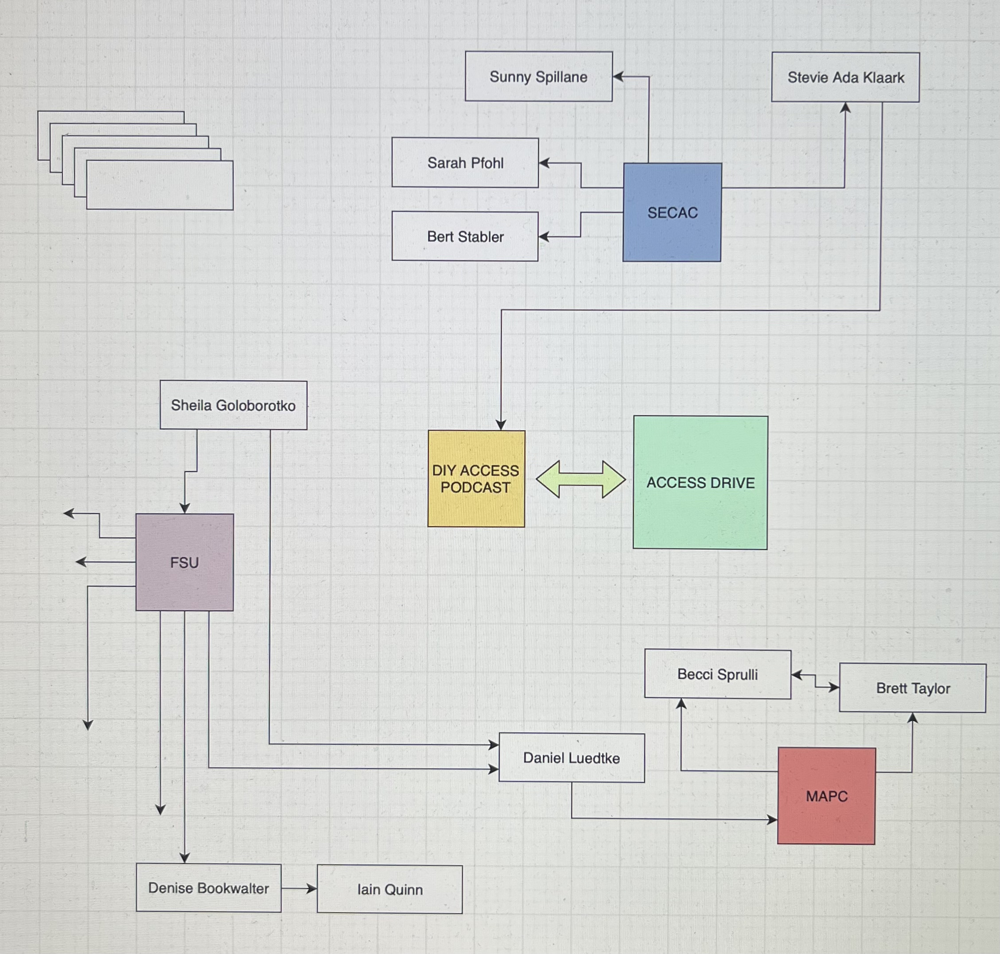

# WEEK FIVE

I am moving away from literal definitions of drawing and thinking about how I am moving through the world and drawing energy into the places I want to see change. I have been steadily building a network of people who have years of academic experience, either as students or teachers. Their on the ground experience can provide prototypes for fixes that would otherwise be difficult or impossible to achieve when bogged down with the paperwork and legalese of bureaucracy. I started making visual maps of these connective webs, as they run through my personal projects and these larger national and international institutions. There have been several interations so far, each becomming more refined. I find it interesting that the diagramatic webs I am drawing are very similar to the circuit diagrams I have been looking at and implementing in our electronics labs.  

  
  
  
